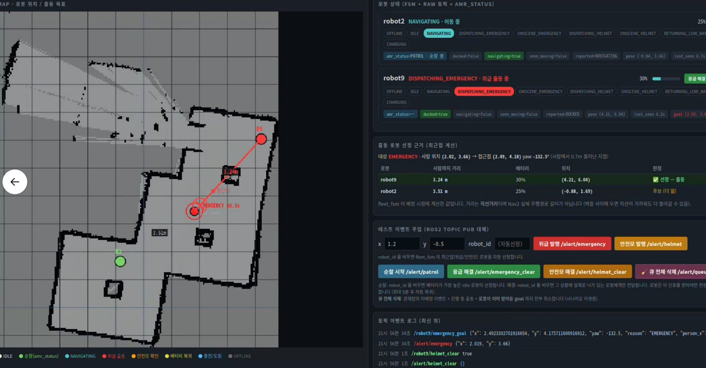
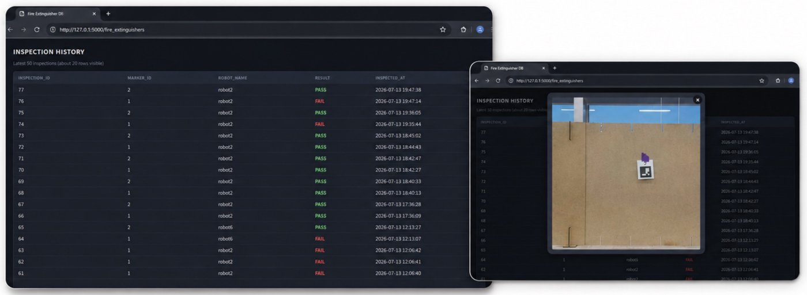
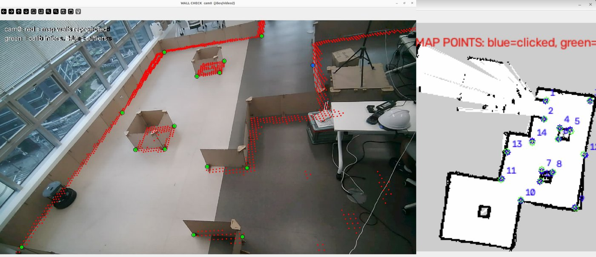

# 산업안전 AMR 관제 시스템 (intelli1)

> 두산로보틱스 ROKEY 부트캠프 팀 프로젝트의 제출 스냅샷을 포트폴리오용으로 공개한 저장소입니다. 코드는 제출 당시 그대로이고, README를 정리했습니다.

> ▶️ **[1분 시연 영상](https://youtu.be/-Q8ITIWgUp4)** — 이 프로젝트를 가장 빨리 파악할 수 있는 자료입니다. 참고 문서는 [더 읽을 문서](#더-읽을-문서), 본인 담당은 [프로젝트 요약](#contribution)에 있습니다.
>
> 📄 [발표 자료(PDF, 58쪽)](https://github.com/gwanhuiGIM/Rokey_intelli1/releases/download/presentation/intelli1_presentation.pdf) — 세부 기술 발표 자료

천장 웹캠 2대로 작업자의 **쓰러짐 / 안전모 미착용**을 감지하면, 관제 노드 `fleet_fsm`이 TurtleBot4 AMR 2대(`robot2`·`robot9`) 중 출동 가능한 최근접 로봇을 골라 현장으로 보냅니다.
평시에는 AMR이 웨이포인트를 순찰합니다. 이 밖에 소화기 ArUco 인식·점검 결과 DB 기록(SQLite + Flask 조회) 모듈과 무단침입 감지 모듈이 들어 있습니다. 각 모듈의 연결 상태는 [한계](#한계--미완성)에 정리했습니다.

> **핵심 설계**: 토픽을 **관찰(`/safety/*`) → 요청(`/alert/*`) → 명령(`/robotN/*`)** 3계층으로 나눴습니다. 카메라 쪽은 로봇을 모르고, 로봇 쪽은 카메라를 모릅니다. 로봇 선정은 `fleet_fsm` 한 곳에서만 하므로, 웹 버튼으로 넣은 요청도 감지 요청과 같은 경로로 처리됩니다.

```
                    ┌──────────── 비전 (src/1_vision_pc3) ────────────┐
   웹캠 cam0 ──┐    │  YOLO11-pose + 안전모 검출(best.pt)              │
   웹캠 cam1 ──┴───▶│  호모그래피 + Z캘리브 → map 좌표                 │
                    │  쓰러짐 / 안전모 / 침입 판정                      │
                    └───────────────┬─────────────────────────────────┘
                                    │ /safety/*   (관찰, PoseStamped·String)
                                    ▼
                          safety_alert_bridge      (응급·안전모만 변환)
                                    │ /alert/*    (요청, JSON String)  ◀── 웹 버튼
                                    ▼
                    ┌──────────── 관제 fleet_fsm ─────────────────────┐
                    │  후보별 제외 사유 판정 → 최근접 선정 · 큐 관리    │
                    │  상황: NORMAL ↔ EMERGENCY                        │
                    └───────────────┬─────────────────────────────────┘
                                    │ /robotN/*   (명령, latched JSON)
                    ┌───────────────┴───────────────┐
                    ▼                               ▼
      amr_patrol_emer_helmet (robot2)   amr_patrol_emer_helmet (robot9)
      Nav2 주행 · 순찰 · 도킹                        ┆ 소화기 지점 도착
                                                    ┆ aruco_scan_enable (연결 미완성, 한계 참조)
                                                    ▼
      aruco_detect (OAK-D) ──/robotN/aruco/detection/ids──▶ sqlite3db db_update
                       ◀──────── /robotN/aruco_check_done ──────────┘   │
                                                              Flask app (점검 현황)
```

<a id="contribution"></a>
## 프로젝트 요약 · 본인 담당 (김관희)

> 포트폴리오용 프로젝트 요약입니다. 이 저장소의 코드는 팀 최종 제출본이고, 제 역할 범위는 **본인 담당** 행에 적었습니다. 접힌 '프로젝트 기술 전체'는 팀 전체 시스템 설명입니다. 다른 프로젝트: [github.com/gwanhuiGIM](https://github.com/gwanhuiGIM)

**모사한 산업 현장을 순찰하다가, 관제 웹캠이 안전모 미착용·작업자 쓰러짐을 감지하면 출동 가능한 AMR을 보내 조치하는 시스템을 구현하였습니다.**<br>
이 과정에서 에러 메시지 없이 로봇을 헛걸음시킬 수 있던 신호 흔들림을 단계별로 쪼개 잡았습니다.

AMR 2대 · 천장 웹캠 2대 · 3인 팀 · ROKEY 2차 (26.07.01~26.07.14)
**본인 담당:** 관제 FSM(우선순위 선점)·쓰러짐 판정 규칙·메시지 전달 정책 설계와 디버깅

- **개요:** 천장 웹캠이 쓰러짐·안전모 미착용·무단침입을 감지하면 가장 가까운 AMR을 출동시키는 안전관제 시스템
- **선점 FSM:** 응급 > 안전모 > 순찰 순으로 현재 작업 선점
- **신호 흔들림:** 쓰러지는 순간 응급 발동·해제가 1초에 5번 뒤집힘(디버깅 기록) → 해제 방향에만 지연을 걸어 응급 반응 속도 유지
- **재배정 반복:** 이전 작업 취소를 "이동 끝"으로 오인 → "취소 중" 상태 분리
- **쓰러짐 판정:** 가정이 깨지는 머리 높이 대신 몸통 각도를 주지표로, 다리가 서 있으면 거부
- **회고:** 조용히 틀리는 문제일수록 신호를 단계별로 쪼개 원인을 좁혀야 한다

<details>
<summary><b>프로젝트 기술 전체 · 코드 근거</b></summary>

- **감지(천장 웹캠 2대):** YOLO11-pose 자세 추정 + YOLOv8 안전모 검출(Roboflow 라벨링 → 학습), 호모그래피·Z 캘리브레이션(DLT 투영행렬)으로 map 좌표 변환, 두 카메라 간 동일 인물 통합(Re-ID)
- **관제:** `fleet_fsm`이 최근접 로봇 선정·접근점 계산·큐 관리·상황 상태머신(NORMAL↔EMERGENCY) 수행, rosbridge 웹 관제 화면(출동 근거·이벤트 주입)
- **메시지 정책:** 상태 라벨·좌표 명령·영상의 QoS(메시지 전달 보장 정책)를 의미별로 분리, timestamp 기준 30초를 넘긴 명령은 버려 오래된 명령의 재출동 위험 감소
- **로봇 실행부:** TurtleBot4 Nav2/AMCL 주행·순찰·도킹, OAK-D 카메라로 소화기 ArUco 마커 인식
- **점검 DB:** ArUco 인식 결과로 소화기 점검 이력 갱신, SQLite + Flask 웹 조회
- **코드 근거:** [해제 방향 디바운스 — `ros_bridge.py`](https://github.com/gwanhuiGIM/Rokey_intelli1/blob/main/src/1_vision_pc3/safety_lib/ros_bridge.py#L473-L499) · [의미별 QoS](https://github.com/gwanhuiGIM/Rokey_intelli1/blob/main/src/1_vision_pc3/safety_lib/ros_bridge.py#L75-L126) · [`CANCELING` 처리 — `fleet_fsm.py`](https://github.com/gwanhuiGIM/Rokey_intelli1/blob/main/src/2_ros2_packages/fp_amr_fsm/fp_amr_fsm/fleet_fsm.py#L565-L574) · [쓰러짐 판정 — `safety_logic.py`](https://github.com/gwanhuiGIM/Rokey_intelli1/blob/main/src/1_vision_pc3/safety_lib/safety_logic.py#L230-L275) · [30초 stale 필터](https://github.com/gwanhuiGIM/Rokey_intelli1/blob/main/src/2_ros2_packages/fp_amr_fsm/fp_amr_fsm/amr_patrol_emer_helmet.py#L385-L403)

</details>

## 무엇을 할 수 있나

| 기능 | 시스템이 하는 일 | 담당 |
|---|---|---|
| 위험 감지 | 천장 웹캠 2대의 영상에서 쓰러짐·안전모 미착용·무단침입을 판정하고, 사람 위치를 map 좌표로 바꿔 `/safety/*`로 발행합니다 | `src/1_vision_pc3/safety_lib/` |
| 쓰러짐 출동 | 상황을 `EMERGENCY`로 바꾸고, 사람에게서 0.7 m 떨어진 접근점으로 로봇을 출동시킵니다. 이때 배터리는 보지 않습니다 | `safety_alert_bridge` → `fleet_fsm` → `amr_patrol_emer_helmet` |
| 안전모 배달 | 대기 중이거나 순찰 중인 로봇을 보내 안전모를 배달합니다. 배달 후에는 도킹하지 않고 끊긴 지점부터 순찰을 이어 갑니다 | 위와 같음 |
| 순찰 · 소화기 점검 | 웨이포인트를 순찰하고, 소화기 지점에서는 ArUco 대조가 끝날 때까지 기다립니다. 소화기 모듈은 인식한 마커 ID로 점검 결과와 스냅샷을 DB에 기록합니다(실행부와의 연결은 [한계](#한계--미완성)) | `amr_patrol_emer_helmet`, `aruco_detect`, `db_update` |
| 관제 · 점검 웹 | 지도 위에 로봇과 사람 위치, 로봇별 선정 근거(거리·배터리·제외 사유)를 보여 주고 이벤트를 주입할 수 있습니다. 소화기 점검 결과와 스냅샷은 Flask 웹에서 조회합니다 | `fleet_monitor.html`(rosbridge), `sqlite3db`의 `app` |

<p align="center"></p>
<p align="center"><sub>관제 웹 <code>fleet_monitor.html</code> — 지도 위 로봇·사람 위치, 로봇별 선정 근거(거리·배터리), 이벤트 주입</sub></p>

<p align="center"></p>
<p align="center"><sub>Flask 웹(<code>127.0.0.1:5000</code>) — 소화기 점검 결과와 스냅샷 조회</sub></p>

<p align="center"></p>
<p align="center"><sub>호모그래피 검증 — 왼쪽 cam0 영상, 오른쪽 map의 대응점</sub></p>

## 시스템 구조

<details>
<summary>모듈별 파일·노드, 우선순위, 토픽 계약, 현재 경로와 이력</summary>

**비전** — `src/1_vision_pc3/`는 ROS 패키지가 아닌 단독 Python 프로그램입니다.
- 진입점은 `12_dual_camera_entry_yolo_tracking_modular.py`이고, 판정 로직은 `safety_lib/`에 있습니다.

| 파일 | 하는 일 |
|---|---|
| `safety_lib/vision_core.py` | 카메라 루프, YOLO 추론(pose 모델은 사람·키포인트, `best.pt`는 helmet bbox만), 좌표 변환 |
| `safety_lib/safety_logic.py` | 쓰러짐/안전모 판정, 트랙별 상태 |
| `safety_lib/base_utils.py` | 호모그래피, Z캘리브(3×4 P 행렬), 키포인트 유틸 |
| `safety_lib/global_fusion.py` | 두 카메라에 잡힌 같은 인물을 하나로 묶음 (global_id) |
| `safety_lib/ros_bridge.py` | `/safety/*` 발행 (아래 토픽 표) |

**관제** — `src/2_ros2_packages/fp_amr_fsm`

| 노드 | 하는 일 |
|---|---|
| `fleet_fsm` | 로봇별 상태 추적, 출동 로봇 선정, 응급/안전모/순찰 큐 관리, `/fleet/status` 발행 |
| `safety_alert_bridge` | `/safety/{emergency,helmet}_*`(PoseStamped)을 `/alert/*`(JSON String)로 변환 |

로봇 상태는 표준 토픽(`battery_state`, `dock_status`, `amcl_pose`)과 노드 그래프로 판단합니다.
- `OFFLINE` / `NO_LOCALIZATION` / `NO_NAV2`인 로봇은 어떤 출동에서도 빠집니다.
- `NO_NAV2`는 노드 그래프에 `planner_server`가 있는지로 판단합니다. 그래서 `ROS_SUPER_CLIENT=True`가 필요합니다([실행](#실행)).

**실행부** — `src/2_ros2_packages/fp_amr_fsm`의 `amr_patrol_emer_helmet`
- 로봇마다 1개씩 띄우며, `TurtleBot4Navigator`(Nav2)로 이동합니다.
- payload의 `timestamp`가 30초 넘게 지난 명령은 버립니다(`amr_patrol_emer_helmet.py:78`).
- 현장 대기는 최대 5분입니다(`:144`).

**소화기 점검** — `src/2_ros2_packages/amr_aruco`의 `aruco_detect`와 `src/2_ros2_packages/sqlite3db`

| 노드 | 하는 일 |
|---|---|
| `aruco_detect` | `aruco_scan_enable`이 True인 동안에만 OAK-D(`oakd/rgb/image_raw/compressed`)를 구독하고, `aruco/detection/ids`(Int32MultiArray)를 발행합니다 |
| `db_update` | `/robotN/aruco/detection/ids`를 받아 점검 결과와 스냅샷을 기록하고 `/robotN/aruco_check_done`을 발행합니다 |
| `ros2_db_node` | ROS 토픽과 DB를 연동합니다 (로봇 카메라 프레임 저장 포함) |
| `create_db` | DB와 테이블을 만들고 CSV·JSON·XLSX 초기 데이터를 넣습니다 |
| `app` | Flask 웹, `127.0.0.1:5000` |

### 우선순위

> **응급(EMERGENCY) > 안전모(HELMET) > 순찰**

- 응급은 배터리·충전 상태를 보지 않습니다. 물리적으로 갈 수 없는 상태(`OFFLINE`, `NO_NAV2`, 측위 미실행, 위치 미수신)만 제외합니다(`fleet_fsm.py:1097-1123`).
- 안전모는 순찰을 선점합니다. 배달이 끝나면 같은 웨이포인트 index부터 순찰을 재개합니다.
- 요청에 `robot_id`를 지정했는데 그 로봇이 갈 수 없는 경우:
  - 응급이 아니면 요청을 한 번 경고하고 버립니다.
  - 응급이면 큐에 되돌려 재시도합니다(`fleet_fsm.py:1061-1070`).

### 토픽 계약

| 계층 | 토픽 | 의미 |
|---|---|---|
| 관찰 | `/safety/emergency_state`·`_goal`, `/safety/helmet_state`·`_goal`, `/safety/unauthorized_state`·`_person`, `/safety/persons`(MarkerArray), `/safety/persons_json` | 카메라가 본 것입니다. 로봇 개념이 없고, 좌표는 사람의 발 위치입니다 |
| 요청 | `/alert/emergency`, `/alert/helmet`, `/alert/emergency_clear`, `/alert/helmet_clear`, `/alert/patrol`, `/alert/queue_clear` | 관제가 받는 창구입니다. 감지에서 오든 웹에서 오든 같게 처리합니다 |
| 명령 | `/robotN/emergency_goal`, `/robotN/helmet_goal`, `/robotN/patrol_cmd`, `/robotN/*_clear` | 특정 로봇에게 보내는 명령입니다. 좌표는 사람에서 0.7 m 물러난 접근점이고, yaw는 사람을 바라보는 방향입니다 |

명령 토픽 QoS는 `RELIABLE` + `TRANSIENT_LOCAL`(depth 1)입니다.
- 나중에 뜬 구독자도 마지막 명령을 받도록 한 설정입니다.
- 그 대가로 옛 명령이 늦게 도착할 수 있어서, 실행부가 위의 30초 기준으로 걸러 냅니다.

### 현재 경로와 이력

| 경로 | 지위 |
|---|---|
| `src/1_vision_pc3/`, `src/2_ros2_packages/*` | **현재 경로**입니다 (robot2·robot9) |
| `src/2_ros2_packages/amr_aruco`의 `amr_patrol_emer_helmet` | 실행부를 모듈로 나눈 판입니다. ArUco 게이트 연동은 있지만, `fp_amr_fsm`판의 최신 수정(`helmet_clear`, 현장 5분 상한 등)은 빠져 있습니다 |
| `src/fp_amr_fsm/` | 관제 리팩터 시도입니다 (`robot_context.py`·`map_view.py`·launch·params로 분리). 기본 robots가 `robot2`·`robot6`이고 실행부가 없습니다 |
| `src/fp_amr_vision/` | 구 패키지명 시절의 이력입니다 |
| `src/3_calibration_tools/06~12`, `debug_posture.py` 등 | 판정 알고리즘 개발 이력입니다 (bbox → z → pose) |
| `src/turtlebot4*`, `src/m-explore-ros2` | upstream 코드입니다 |

</details>

## 한계 · 미완성

- **무단침입은 출동으로 이어지지 않습니다.** 비전이 `/safety/unauthorized_*`를 발행하지만 `safety_alert_bridge`·`fleet_fsm`·웹 어디서도 구독하지 않습니다.
- **현재 경로에서는 소화기 점검 게이트가 연결되지 않습니다.** `aruco_detect`를 켜는 `aruco_scan_enable`은 `amr_aruco`판 실행부(`patrol_navigator.py:71`)만 발행해서, `fp_amr_fsm`판 실행부는 소화기 지점에서 `aruco_check_done`을 기다리며 서 있습니다(`amr_patrol_emer_helmet.py:533`). 응급·안전모 요청, 저배터리 복귀(`:511-518`), 수동 `aruco_check_done` 발행으로 풀립니다.
- **`start.sh`·`4_docs/`는 원래 실행 PC 기준이라 그대로 돌지 않습니다.** 경로(`$HOME/turtlebot4_ws/final_project/{detection_final, fp_amr_fsm_connec_vision}`)·로봇 IP(`192.168.107.x`)·NIC(`wlo1`)가 하드코딩돼 있습니다(`start.sh:15,25,127,130,141`).
- **helmet 모델 `best.pt`는 저장소에 없습니다.** 없으면 감지 프로그램이 시작 단계에서 멈춥니다([저장소 구성](#저장소-구성)).
- **`src/` 전체를 `colcon build`하면 깨집니다.** `fp_amr_fsm` 패키지가 두 곳에 있습니다([설치](#설치)).

<details>
<summary>그 밖의 제약</summary>

- 두 판의 통합(`amr_aruco`의 모듈 구조 + `fp_amr_fsm`의 최신 수정)은 남은 과제입니다.
- 실행부의 순찰 웨이포인트(`PATROL_POINTS`)와 `fleet_fsm`의 `ROBOTS`가 코드 상수로 박혀 있습니다. 웹 `fleet_monitor.html`의 `ROBOTS`와 손으로 맞춰야 합니다.
- Flask `app`은 `127.0.0.1:5000`, `debug=True`로 뜹니다. 다른 PC에서는 접속할 수 없습니다.

</details>

## 더 읽을 문서

| 문서 | 내용 | 지위 |
|---|---|---|
| `src/2_ros2_packages/fp_amr_fsm/README.md` | 관제·실행부 노드 상세 | 정본 패키지 문서 |
| `src/2_ros2_packages/amr_aruco/README.md` | ArUco 인식·모듈 분리판 실행부, 파라미터 | 정본 패키지 문서 |
| `src/1_vision_pc3/PC3_ROS_INTERFACE.md` | 비전이 발행하는 토픽 명세 | 정본 |
| `4_docs/RUN_PC3.md`, `PC4_SETUP.md`, `FOR_AMR_TEAM.md` | PC별 실행 절차 (원래 실행 PC 경로 기준) | 참고 이력 |
| `src/fp_amr_fsm/README.md` | 리팩터 시도판 설명 (robot2·robot6) | 참고 이력 |

## 환경 · 장비

<details>
<summary>OS·RMW, 장비 설정, PC 배치, 보정 도구</summary>

- Ubuntu 22.04, ROS 2 Humble, Python 3. 비전 PC에서는 YOLO 추론을 돌립니다(GPU 필요 여부는 확인하지 않았습니다).
- RMW는 `rmw_fastrtps_cpp`, `ROS_DOMAIN_ID=6`이고, 로봇 2대를 Discovery Server로 묶습니다.

| 장비 | 설정 |
|---|---|
| TurtleBot4 ×2 | namespace `robot2`, `robot9`. Discovery Server를 로봇마다 하나씩 둡니다(문자열 위치 2·9, 서버 설정과는 대조 전. `start.sh` 주석엔 robot9 자리가 6) |
| 천장 웹캠 ×2 | cam0 = "Web Camera", cam1 = "USB Composite"(Jieli). `start.sh`는 `v4l2-ctl` 이름으로 찾습니다 |
| 비전 PC | 감지, `fleet_fsm`, bridge, rosbridge, 웹 서빙을 맡습니다 |
| AMR PC | 로봇별 localization, nav2, `amr_patrol_emer_helmet`을 맡습니다 |

PC 배치 문서는 둘입니다.
- `4_docs/RUN_PC3.md`: PC 한 대로 전부 돌리는 검증용 배치입니다.
- `4_docs/FOR_AMR_TEAM.md`: 비전 PC와 AMR PC로 나누는 배치입니다.

**보정**: `src/1_vision_pc3/calibration/`의 `camN_to_map.npz`(호모그래피)·`camN_z_calib.npz`(3×4 P)·`entry_roi.json`은 카메라 위치와 맵(`final_project.yaml`)에 묶여 있습니다. 카메라를 옮기거나 맵을 다시 만들면 `src/3_calibration_tools/`로 다시 만들어야 합니다(번호가 곧 작업 순서).

| 스크립트 | 하는 일 |
|---|---|
| `00_capture_ref.py` · `01_dual_camera_capture.py` | 기준 프레임을 촬영합니다 |
| `02_make_homography_pairwise.py` | 픽셀↔map 대응점으로 `camN_to_map.npz`를 만듭니다 |
| `03` · `04` | 호모그래피를 눈으로 검증합니다 |
| `05_guided_…` / `05_auto_single_camera_capture.py` | 높이별 대응점을 수집합니다 |
| `08_z_height_calibration_test.py` | 3×4 P를 구해 `camN_z_calib.npz`를 만듭니다 |

</details>

## 저장소 구성

<details>
<summary>디렉터리 트리, 저장소에 없는 것(모델 가중치 등)</summary>

```
.
├── src/
│   ├── 1_vision_pc3/          # 비전 감지 (단독 Python) + calibration/ + 맵
│   ├── 2_ros2_packages/       # 현재 ROS 2 패키지: fp_amr_fsm, amr_aruco, sqlite3db
│   ├── 3_calibration_tools/   # 호모그래피·Z캘리브 제작 도구 + 판정 개발 이력
│   ├── fp_amr_fsm/            # 이력: 관제 리팩터 시도 (같은 패키지명!)
│   ├── fp_amr_vision/         # 이력: 구 패키지 + ArUco 마커 이미지
│   └── turtlebot4*, m-explore-ros2   # upstream
├── map/                       # final_project 맵 + fleet_monitor.html 사본
├── 4_docs/                    # 실행 절차서 (RUN_PC3, PC4_SETUP, FOR_AMR_TEAM)
└── start.sh                   # 비전 PC 일괄 기동 스크립트 (원래 실행 PC 경로 기준, 한계 참조)
```

**저장소에 없는 것**

| 항목 | 받는 법 |
|---|---|
| 모델 가중치 `*.pt` (`.gitignore`로 제외) | 아래 두 줄 참고 |
| `fire_db.db` | `create_db`가 만듭니다 |
| `camera_frames/` | 실행 중에 생깁니다 |

- `yolo11s-pose.pt`: ultralytics 공개 가중치입니다. 첫 로드 때 자동으로 내려받을 수 있습니다(설치 3단계).
- `yolo_experiments/best.pt`: **미포함입니다(팀이 학습한 helmet 모델).** 없으면 감지 프로그램이 시작 단계에서 `FileNotFoundError`로 멈춥니다.

</details>

## 설치

<details>
<summary>설치·빌드 절차와 주의점</summary>

```bash
# 1. ROS 의존성: package.xml의 exec_depend (flask, openpyxl, opencv, nav2_simple_commander, turtlebot4_navigation 등)
sudo apt install python3-opencv ros-humble-rosbridge-server
rosdep install --from-paths src/2_ros2_packages --ignore-src -y

# 2. 비전 전용 pip 패키지 (ultralytics만 pip)
pip install ultralytics      # opencv-python이 딸려 오면 rclpy와 충돌 가능 → 아래 주의
                             # numpy는 2.0 미만 필요 (Humble cv_bridge 호환)

# 3. pose 모델: 파일이 없으면 감지 프로그램이 시작하지 않으므로 미리 받아 둠
(cd src/1_vision_pc3 && python3 -c "from ultralytics import YOLO; YOLO('yolo11s-pose.pt')")   # subshell이라 끝나면 저장소 루트로 복귀

# 4. 빌드: 현재 경로 패키지만
colcon build --symlink-install --base-paths src/2_ros2_packages
source install/setup.bash
```

빌드할 때 주의할 점:
- **`src/` 전체를 대상으로 `colcon build`하지 마세요.**
  - `src/fp_amr_fsm`과 `src/2_ros2_packages/fp_amr_fsm`의 패키지 이름이 둘 다 `fp_amr_fsm`이라 colcon이 중복 패키지로 멈춥니다.
  - `src/fp_amr_vision`에도 같은 이름의 실행 파일이 있습니다.
- **OpenCV는 apt(`python3-opencv`)를 쓰세요.** pip `opencv-python`과 rclpy가 한 프로세스에 함께 올라가면 Qt 충돌로 segfault가 날 수 있습니다.

> 이 절의 명령은 코드와 `package.xml` 기준으로 정리했습니다(새 환경에서 처음부터 재현하지는 않음).

</details>

## 실행

<details>
<summary>실행 순서, 분할 기동 명령, 종료 방법</summary>

모든 터미널에서 공통 환경을 먼저 잡습니다.

```bash
source /opt/ros/humble/setup.bash && source install/setup.bash
export RMW_IMPLEMENTATION=rmw_fastrtps_cpp
export ROS_DOMAIN_ID=6
export ROS_DISCOVERY_SERVER=";;<robot2_ip>:11811;;;;;;;<robot9_ip>:11811"   # 위치 2 = robot2, 9 = robot9 (서버 설정과 대조 전)
export ROS_SUPER_CLIENT=True   # 필수
```

`ROS_SUPER_CLIENT=True`는 필수입니다.
- 일반 client는 자기가 구독하는 토픽만 discovery합니다.
- 그래서 `fleet_fsm`이 살아 있는 `planner_server`를 보지 못해 `NO_NAV2`로 판단하고, 출동을 배정하지 않습니다.

| 순서 | 실행 | 위치 | 정상이면 |
|---|---|---|---|
| 1 | `ros2 launch turtlebot4_navigation localization.launch.py namespace:=/robotN map:=<final_project.yaml>` | AMR PC | `/robotN/amcl_pose` 수신 |
| 2 | `ros2 launch turtlebot4_navigation nav2.launch.py namespace:=/robotN` | AMR PC | `planner_server` 노드가 뜸 |
| 3 | `ros2 run fp_amr_fsm amr_patrol_emer_helmet --robot robotN` | AMR PC | 도킹 상태로 `patrol_cmd`를 기다림 |
| 4 | `ros2 run amr_aruco aruco_detect` (기본 namespace `robot2`) | AMR PC | 소화기 점검 경로, 한계 참조 |
| 5 | rosbridge + `fleet_fsm` + `safety_alert_bridge` + 웹 서빙 + 감지 | 비전 PC | 아래 참조 |
| 6 | `ros2 launch sqlite3db monitoring.launch.py` | 관제 PC | `create_db`가 끝난 뒤 `ros2_db_node`·`db_update`·`app`이 respawn으로 뜸 |
| 7 | 브라우저에서 `http://<비전PC_IP>:8000/fleet_monitor.html` | 임의 PC | rosbridge(9090) 연결 표시 |

5단계는 원래 `./start.sh`로 한 번에 띄웠습니다. 이 저장소에서는 아래처럼 나눠 띄웁니다(`start.sh` 경로 문제는 [한계](#한계--미완성), 분할 명령은 재현 전).

```bash
ros2 launch rosbridge_server rosbridge_websocket_launch.xml        # 포트 9090. 중복 실행 시 웹이 좀비 쪽에 붙어 'connecting'에서 멈춤
ros2 run fp_amr_fsm fleet_fsm
ros2 run fp_amr_fsm safety_alert_bridge
python3 -m http.server 8000 --directory src/2_ros2_packages/fp_amr_fsm/web   # 다른 PC에서 접속하려면 http로 서빙
cd src/1_vision_pc3 && python3 12_dual_camera_entry_yolo_tracking_modular.py --cam0-id <N> --cam1-id <M> --publish-ros
```

- 감지 프로그램은 모델·캘리브레이션을 스크립트 위치 기준으로 찾습니다. 카메라 번호는 `v4l2-ctl --list-devices`로 확인합니다.

**종료**
- 감지는 반드시 **감지 창에서 `q`**로 끝내세요.
  - `kill -9`로 죽이면 `cap.release()`가 돌지 않아 UVC 카메라가 물린 채로 남습니다. 다음 실행 때 프레임을 한 장도 읽지 못합니다.
  - 복구 명령은 `sudo usbreset <vendor:product>`입니다(cam1은 `4c4a:4a55`).
  - `start.sh --stop`도 감지에는 SIGINT만 보냅니다.
- 로봇은 Nav2 goal이 끝났거나 취소됐는지 확인한 뒤 실행부를 끕니다(실행부에 별도의 종료 절차 코드는 없습니다).

</details>

## 검증

- 자동 테스트는 각 패키지의 `test_copyright`·`test_flake8`·`test_pep257`(스타일 린트)뿐입니다. 판정·선정 로직의 단위 테스트는 없습니다(README 정리 때 재실행하지 않음).
- 실기 성능 검증은 하지 않았습니다.

## License

별도 license를 부여하지 않습니다 (All rights reserved). 팀 프로젝트 결과물을 포트폴리오로 열람할 수 있게 공개한 것입니다.
`src/turtlebot4*`, `src/m-explore-ros2`는 upstream 코드이며 각 디렉터리의 `LICENSE`(Apache-2.0 / BSD)를 따릅니다.
